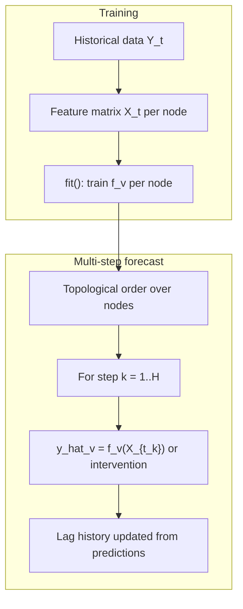

# Mathematical Foundations

This document describes **exactly what the CausalForecasting package implements** — feature construction, per-node models, multi-step forecasting, counterfactuals, and evaluation metrics. Each section references the source module that implements the math.

**Scope:** The package implements a **learned structural autoregressive structural causal model (SCM)**. Each node is a supervised model conditioned on lagged parents, calendar features, and (optionally) seasonal lags. The user-supplied DAG defines the propagation order. This is predictive simulation, not causal identification or full do-calculus.

---

## 1. Problem Setup and Notation

### Data and graph

- **Observed series:** multivariate time series $\{Y_t\}_{t=1}^{N}$ stored in a DataFrame, with a designated time column $T$ (e.g. `timestamp`).
- **Causal graph:** directed acyclic graph $G = (V, E)$ where each node $v \in V$ is a variable column and each edge $(u, v) \in E$ means $u$ is a direct cause of $v$.
- **Parent set:** $\mathrm{Pa}(v) = \{u : (u, v) \in E\}$.
- **Topological order:** $\pi = (v_1, \ldots, v_{|V|})$ from `networkx.topological_sort(G)` so that all parents of $v_j$ appear before $v_j$.

*Source:* [`causal_forecast/core.py`](../causal_forecast/core.py) (lines 115, 87–88), [`causal_forecast/utils.py`](../causal_forecast/utils.py) (`validate_graph_data`).

### Timestep

The median timestep between consecutive observations is:

$$
\Delta t = \mathrm{median}\big(\{T_i - T_{i-1}\}_{i=2}^{N}\big)
$$

*Source:* [`causal_forecast/utils.py`](../causal_forecast/utils.py) — `infer_time_delta`.

### Data frequency label

From $\Delta t$ in days, the package assigns a coarse frequency label:

| Condition on $\Delta t$ (days) | Label |
|----------------------------------|-------|
| $\leq 2$ | `daily` |
| $\leq 10$ | `weekly` |
| $\leq 45$ | `monthly` |
| otherwise | `yearly` |

*Source:* [`causal_forecast/seasonality.py`](../causal_forecast/seasonality.py) — `infer_data_frequency`.

### End-to-end flow

---

## 2. Feature Engineering

For each node $n$, a feature matrix $X_t$ is built at each time index $t$. Training uses `_prepare_time_series_data`; forecasting uses `_build_prediction_features`.

*Source:* [`causal_forecast/core.py`](../causal_forecast/core.py) (lines 117–183, 288–340).

### 2.1 Calendar features (always)

From timestamp $t$:

$$
\mathrm{year}(t),\quad \mathrm{month}(t),\quad \mathrm{day}(t),\quad \mathrm{dayofweek}(t) \in \{0, \ldots, 6\}
$$

### 2.2 Cyclical features (when `seasonality` is non-empty)

When any seasonality is requested, sin/cos encodings are added for weekly, monthly, and yearly patterns:

$$
\sin\!\left(\frac{2\pi \, u}{P}\right), \quad \cos\!\left(\frac{2\pi \, u}{P}\right)
$$

| Component $u$ | Period $P$ | Feature names |
|-----------------|--------------|---------------|
| day of week | 7 | `dayofweek_sin`, `dayofweek_cos` |
| month | 12 | `month_sin`, `month_cos` |
| day of year | 365.25 | `dayofyear_sin`, `dayofyear_cos` |

*Source:* [`causal_forecast/seasonality.py`](../causal_forecast/seasonality.py) — `add_cyclical_time_features`, `cyclical_features_from_date`.

### 2.3 Short lag features

For each variable $v \in \mathrm{Pa}(n) \cup \{n\}$ and lag $\ell = 1, \ldots, L$ where $L =$ `lookback_periods`:

**Continuous:**

$$
x^{(v)}_{\ell}(t) = v_{t-\ell}
$$

Feature name: `{var}_lag_{lag}`.

**Categorical — label-encoded** (binary, or when `use_one_hot_parents=False`):

$$
x^{(v)}_{\ell}(t) = \mathrm{LabelEncode}(v_{t-\ell})
$$

**Categorical — one-hot** (multiclass/ordinal parents when `use_one_hot_parents=True`):

$$
\mathbf{h}^{(v)}_{\ell}(t) = \mathrm{OneHot}(v_{t-\ell}) \in \{0, 1\}^{|\mathcal{C}_v|}
$$

Feature names: `{var}_lag_{lag}_cat_{category}` for each category in $\mathcal{C}_v$. Missing lags produce NaN in all one-hot columns.

*Source:* [`causal_forecast/utils.py`](../causal_forecast/utils.py) — `expand_categorical_lag_features`, `build_label_encoder`, `encode_values`.

### 2.4 Seasonal lag features (opt-in)

When `seasonality` is set (e.g. `['weekly', 'monthly', 'yearly']`), for each enabled season $s$ with period $P_s$:

$$
x^{(v)}_{s}(t) = v_{t - P_s}
$$

Encoding follows the same rules as short lags (raw value, label-encoded, or one-hot). Feature names: `{var}_s_lag_{season_name}` or `{var}_s_lag_{season_name}_cat_{category}`.

**Period map** (`FREQUENCY_PERIOD_MAP`):

| Frequency | weekly | monthly | yearly |
|-----------|--------|---------|--------|
| daily | 7 | 30 | 365 |
| weekly | — | 4 | 52 |
| monthly | — | — | 12 |

**Validation:** season $s$ is enabled only if $N \geq P_s + L + 1$.

*Source:* [`causal_forecast/seasonality.py`](../causal_forecast/seasonality.py) — `seasonal_periods`, `validate_seasonality`, `add_seasonal_lag_features`.

### 2.5 Training sample alignment

$$
\mathrm{max\_history} = \max\big(L,\; P_{\mathrm{weekly}}, P_{\mathrm{monthly}}, P_{\mathrm{yearly}}, \ldots\big)
$$

Rows $t \leq \mathrm{max\_history}$ are dropped, then any remaining row with NaN features is dropped. The target for node $n$ is $y_t = n_t$.

$$
\mathcal{D}_n = \{(X_t, y_t)\}_{t > \mathrm{max\_history},\; X_t \text{ complete}}
$$

*Source:* [`causal_forecast/core.py`](../causal_forecast/core.py) (lines 112–113, 176–179).

---

## 3. Per-Node Supervised Models

For each node $n \in \pi$, the package fits a model $\hat{f}_n$ by supervised learning:

$$
\hat{f}_n = \arg\min_{f} \;\mathcal{L}_n(f;\; X_t, y_t), \qquad y_t = n_t
$$

The loss $\mathcal{L}_n$ depends on `model_type` and the variable type of $n$.

*Source:* [`causal_forecast/core.py`](../causal_forecast/core.py) — `fit`; [`causal_forecast/utils.py`](../causal_forecast/utils.py) — `train_node_model`.

### 3.1 Random Forest backend (`model_type="random_forest"`)

| Variable type | Estimator | Target | Split criterion |
|---------------|-----------|--------|-----------------|
| continuous | `RandomForestRegressor(n_estimators=100)` | raw $y$ | mean squared error |
| binary, multiclass, ordinal | `RandomForestClassifier(n_estimators=100)` | $\mathrm{LabelEncode}(y)$ | Gini impurity |

**Regression prediction** (ensemble of $B = 100$ trees):

$$
\hat{y}(x) = \frac{1}{B} \sum_{b=1}^{B} T_b(x)
$$

**Classification prediction:** majority vote over trees on encoded labels, then decoded to original labels.

**Binary probability** (when `return_proba=True`):

$$
\hat{p} = \mathbb{P}(y = 1 \mid X) = \mathrm{predict\_proba}(X)[1]
$$

**Model summary:** mean decrease in impurity (Gini/MSE) per feature $j$, reported as `importance`.

*Source:* [`causal_forecast/utils.py`](../causal_forecast/utils.py) — `train_node_model`, `predict_node_value`; [`causal_forecast/model_summary.py`](../causal_forecast/model_summary.py) — `summarize_random_forest`.

### 3.2 GLM backend (`model_type="glm"`)

The design matrix always includes an intercept:

$$
X' = [\mathbf{1} \mid X]
$$

| Variable type | Model | Mean / link | Fitting |
|---------------|-------|-------------|---------|
| continuous | Gaussian GLM | $\mathbb{E}[y] = X'\beta$ | MLE (statsmodels) |
| binary | Binomial GLM (logit) | $\mathbb{P}(y=1) = \sigma(X'\beta)$ | MLE |
| ordinal | `OrderedModel(distr="logit")` | cumulative logit | BFGS MLE |
| multiclass | `MNLogit` | multinomial logit | MLE |

**Logistic sigmoid:**

$$
\sigma(z) = \frac{1}{1 + e^{-z}}
$$

**Binary GLM:**

$$
\mathbb{P}(y = 1 \mid X) = \sigma(X'\beta)
$$

**Multinomial logit** (class $j$ vs. baseline):

$$
\mathbb{P}(y = j \mid X) = \frac{\exp(X'\beta_j)}{\sum_{k} \exp(X'\beta_k)}
$$

**Ordinal model:** statsmodels `OrderedModel` with `distr="logit"` (cumulative logit with threshold parameters). On convergence failure, the implementation falls back to `MNLogit`.

**Prediction rules (exact code behavior):**

| Type | Point prediction |
|------|------------------|
| continuous | $\hat{y} = X'\hat{\beta}$ |
| binary | $\hat{y} = \mathbb{1}[\hat{p} \geq 0.5]$ where $\hat{p} = \sigma(X'\hat{\beta})$ |
| multiclass / ordinal | $\hat{y} = \arg\max_j \hat{p}_j$, then label-decoded |

**Model summary:** coefficient estimates $\hat{\beta}$, Wald standard errors, $z$-statistics, $p$-values, 95% confidence intervals, AIC, and log-likelihood when available from statsmodels.

*Source:* [`causal_forecast/glm_models.py`](../causal_forecast/glm_models.py); [`causal_forecast/model_summary.py`](../causal_forecast/model_summary.py) — `summarize_glm`.

---

## 4. Multi-Step Recursive Forecasting

### 4.1 Future timestamps

Given the last observed time $t_{\max}$ and horizon $H$:

$$
t_k = t_{\max} + k \cdot \Delta t, \qquad k = 1, \ldots, H
$$

*Source:* [`causal_forecast/core.py`](../causal_forecast/core.py) — `_future_dates`.

### 4.2 Structural forecast equation

For each step $k$ and each node $n$ in topological order $\pi$:

$$
n_{t_k} =
\begin{cases}
a_{n,k} & \text{if node } n \text{ is intervened (counterfactual)} \\[4pt]
\hat{f}_n(X_{t_k}) & \text{otherwise}
\end{cases}
$$

The feature vector $X_{t_k}$ is built from calendar/cyclical features at $t_k$ and lagged values of all variables in $\mathrm{Pa}(n) \cup \{n\}$.

*Source:* [`causal_forecast/core.py`](../causal_forecast/core.py) — `predict`, `_build_prediction_features`.

### 4.3 Lag resolution during forecast

Let $\mathcal{P}$ be the list of prediction dictionaries from steps $1, \ldots, k-1$. For lag $\ell$, the value of variable $v$ used in features is:

$$
v_{t_k - \ell} =
\begin{cases}
\mathcal{P}[-\ell][v] & \text{if } |\mathcal{P}| \geq \ell \quad \text{(forecast history)} \\[4pt]
\text{historical\_tail}[v]_{-(\ell - |\mathcal{P}|)} & \text{otherwise (observed tail)}
\end{cases}
$$

where `historical_tail` is the last `max_history` rows of the training data.

Continuous lags use the raw value. Categorical lags use `value_for_lag_feature` (label encoding) or one-hot vectors depending on configuration.

This recursive mechanism means forecast errors propagate through parent lag features into descendant predictions.

*Source:* [`causal_forecast/core.py`](../causal_forecast/core.py) — `_lag_raw_value`, `_lag_value`; [`causal_forecast/utils.py`](../causal_forecast/utils.py) — `value_for_lag_feature`.

### 4.4 In-sample prediction

One-step-ahead predictions on training-aligned rows (observed lags, no recursive propagation):

$$
\hat{n}_t = \hat{f}_n(X_t), \qquad t > \mathrm{max\_history}
$$

*Source:* [`causal_forecast/core.py`](../causal_forecast/core.py) — `predict_in_sample`.

---

## 5. Counterfactual Interventions

Counterfactuals are **hard interventions**: the structural equation for an intervened node is replaced by a fixed value.

An intervention on node $n$ at step $k$ sets:

$$
n_{t_k} = a_{n,k}
$$

**Scalar intervention** $a_n$: $a_{n,k} = a_n$ for all $k = 1, \ldots, H$.

**Per-step intervention** $a_n = [a_{n,1}, \ldots, a_{n,H}]$: requires $\mathrm{len}(a_n) = H$.

The intervened value is stored in $\mathcal{P}$ and flows into descendant lag features. Descendants are still predicted by $\hat{f}_d(\cdot)$; only the intervened node's equation is bypassed.

*Source:* [`causal_forecast/core.py`](../causal_forecast/core.py) — `_resolve_counterfactual`, `run_counterfactual`, `predict`.

---

## 6. Evaluation Metrics

All metrics are implemented in [`causal_forecast/metrics.py`](../causal_forecast/metrics.py).

### 6.1 Continuous variables

For $n$ paired observations $(y_i, \hat{y}_i)$:

$$
\mathrm{MAE} = \frac{1}{n} \sum_{i=1}^{n} |y_i - \hat{y}_i|
$$

$$
\mathrm{MSE} = \frac{1}{n} \sum_{i=1}^{n} (y_i - \hat{y}_i)^2
$$

$$
\mathrm{RMSE} = \sqrt{\mathrm{MSE}}
$$

$$
\mathrm{MAPE} = \frac{100}{n} \sum_{i=1}^{n} \left| \frac{y_i - \hat{y}_i}{y_i} \right|
$$

MAPE returns NaN if any $y_i = 0$.

### 6.2 Binary variables

- **Accuracy:** fraction of exact label matches.
- **F1:** binary F1 with `pos_label` set to the mode of true labels.
- **Brier score** (when true labels are in $\{0, 1\}$):

$$
\mathrm{BS} = \frac{1}{n} \sum_{i=1}^{n} (\hat{y}_i - y_i)^2
$$

where $\hat{y}_i$ are the **hard** predicted labels (0 or 1), not predicted probabilities.

### 6.3 Multiclass variables

- **Macro-F1:** unweighted mean of per-class F1 scores.
- **Log-loss:** computed using **hard one-hot** predictions. For predicted class $\hat{y}_i$:

$$
\mathbf{p}_i = e_{\hat{y}_i} \quad \text{(one-hot vector)}
$$

$$
\mathrm{LL} = -\frac{1}{n} \sum_{i=1}^{n} \log p_{i, y_i}
$$

This is not the standard log-loss using model probability outputs.

### 6.4 Ordinal variables

- **Accuracy:** fraction of exact label matches.
- **Ordinal MAE:** mean absolute error on numeric label codes:

$$
\mathrm{Ordinal\_MAE} = \frac{1}{n} \sum_{i=1}^{n} |\mathrm{code}(y_i) - \mathrm{code}(\hat{y}_i)|
$$

### 6.5 Primary metric per type

| Variable type | Default metric |
|---------------|----------------|
| continuous | RMSE |
| binary | F1 |
| multiclass | macro-F1 |
| ordinal | ordinal MAE |

*Source:* `primary_metric_for_type`.

### 6.6 Horizon-wise errors

For a single variable at forecast step $h$:

$$
e_h = \hat{y}_h - y_h, \qquad |e_h|, \qquad e_h^2
$$

*Source:* `evaluate_by_horizon`.

### 6.7 Holdout evaluation

Split at cutoff $c = N - H$:

- Train on rows $\{1, \ldots, c\}$
- Predict $H$ steps ahead
- Score predictions against rows $\{c+1, \ldots, c+H\}$

*Source:* [`causal_forecast/core.py`](../causal_forecast/core.py) — `evaluate`.

### 6.8 Walk-forward backtest

Cutoffs:

$$
c \in \{\mathrm{min\_train\_size},\; \mathrm{min\_train\_size} + \mathrm{step\_size},\; \ldots,\; N - H\}
$$

Default $\mathrm{min\_train\_size} = \max(3L, 10)$.

For each fold at cutoff $c$:

1. Train on rows $[1, c)$ (strictly before the test window)
2. Predict horizons $k = 1, \ldots, H$ for timestamps $[c, c+H)$
3. Record per $(\text{fold}, k, \text{variable})$: `actual`, `predicted`

**Aggregation** (`summarize_backtest`): for each variable, compute type-aware metrics per fold, then report `{metric}_mean` and `{metric}_std` across folds.

*Source:* [`causal_forecast/core.py`](../causal_forecast/core.py) — `backtest`, `_run_backtest_fold`; [`causal_forecast/metrics.py`](../causal_forecast/metrics.py) — `summarize_backtest`.

### 6.9 Fit quality ranking

`summarize_fit_quality` ranks variables by a chosen metric (or type-aware primary metric) and labels each as `good` or `poor` relative to the median.

---

## 7. Variable Type Detection

Variable types are assigned by deterministic heuristics, not statistical tests. Priority order (highest first):

1. **User overrides** (`type_overrides` or explicit `variable_types`) — always win.
2. **Ordered pandas `CategoricalDtype`** → `ordinal`.
3. **Boolean dtype** → `binary`.
4. **Object or unordered categorical dtype:**
   - 2 unique values → `binary`
   - otherwise → `multiclass`
5. **Numeric dtype with exactly 2 unique values** (including $\{0,1\}$, $\{\text{yes},\text{no}\}$, etc.) → `binary`.
6. **Integer dtype with $\leq 20$ unique values** → `multiclass`.
7. **Otherwise numeric** → `continuous`.

*Source:* [`causal_forecast/typing.py`](../causal_forecast/typing.py) — `detect_variable_types`, `_detect_single_type`.

---

## 8. Implementation Notes and Assumptions

The following caveats reflect **exact package behavior** and should be kept in mind when interpreting results:

1. **DAG requirement:** The graph must be acyclic. Cycles raise `ValueError`.
2. **User-specified structure:** Causal interpretation assumes the user-supplied DAG is correct. The package does not learn or validate causal structure.
3. **Associational structural equations:** Random Forest and GLM models learn predictive mappings from features to targets. They are not identified causal effect estimators.
4. **Hard interventions only:** Counterfactuals replace node values; they do not shift conditional distributions or remove incoming edges formally.
5. **Discrete metrics caveat:** Multiclass log-loss and binary Brier score use **hard** (discrete) predictions, not model probability outputs.
6. **Fixed seasonal periods:** Weekly (7), monthly (30), and yearly (365) periods are calendar approximations, not estimated from spectral decomposition.
7. **Ordinal fallback:** `OrderedModel` may silently fall back to `MNLogit` if BFGS optimization fails.
8. **Feature alignment:** At forecast time, the feature vector is reordered to match `fitted.feature_names` from training; missing columns are not imputed.
9. **No exogenous variables:** All variables in the DAG are modeled; there is no separate treatment of external/unmodeled covariates.

---

## Source File Index

| Topic | Module |
|-------|--------|
| Topological forecast, backtest, counterfactuals | [`causal_forecast/core.py`](../causal_forecast/core.py) |
| Lag encoding, RF training, prediction | [`causal_forecast/utils.py`](../causal_forecast/utils.py) |
| Cyclical and seasonal features | [`causal_forecast/seasonality.py`](../causal_forecast/seasonality.py) |
| GLM families and prediction | [`causal_forecast/glm_models.py`](../causal_forecast/glm_models.py) |
| Evaluation metrics | [`causal_forecast/metrics.py`](../causal_forecast/metrics.py) |
| Variable type detection | [`causal_forecast/typing.py`](../causal_forecast/typing.py) |
| Model summaries (coefficients, importances) | [`causal_forecast/model_summary.py`](../causal_forecast/model_summary.py) |
